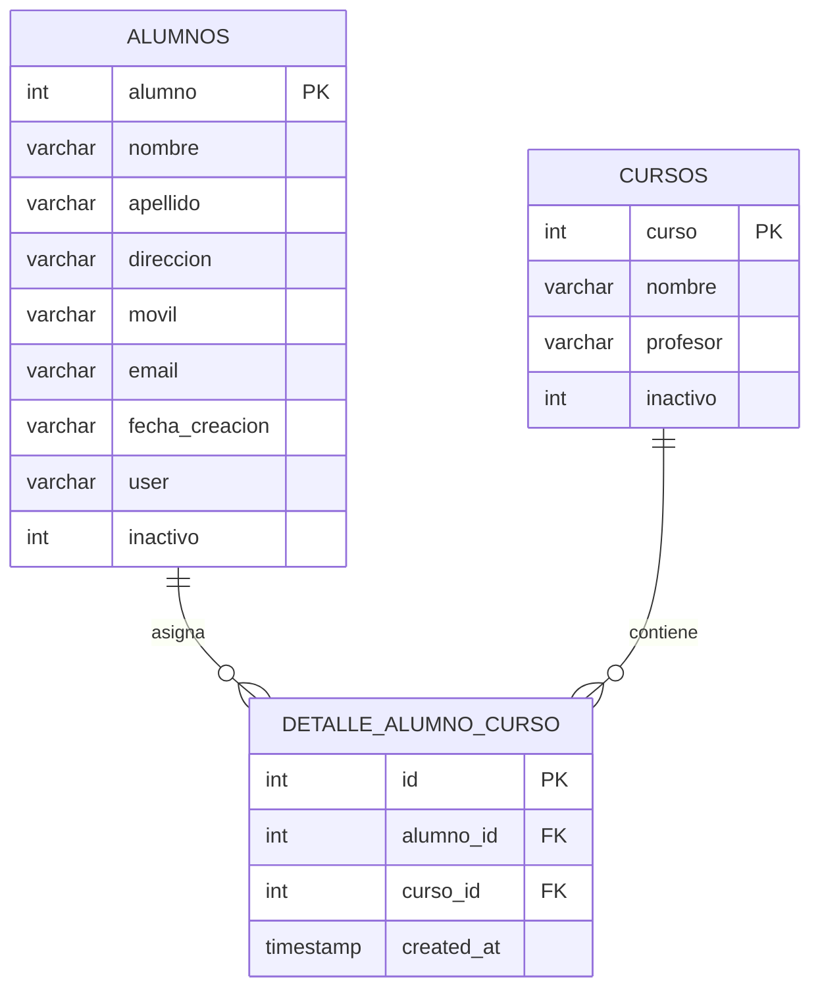

# Diagrama de Base de Datos (Mermaid)

```mermaid
erDiagram
  ALUMNOS {
    int alumno PK
    varchar nombre
    varchar apellido
    varchar direccion
    varchar movil
    varchar email
    varchar fecha_creacion
    varchar user
    int inactivo
  }
  CURSOS {
    int curso PK
    varchar nombre
    varchar profesor
    int inactivo
  }
  DETALLE_ALUMNO_CURSO {
    int id PK
    int alumno_id FK
    int curso_id FK
    timestamp created_at
  }
  ALUMNOS ||--o{ DETALLE_ALUMNO_CURSO : asigna
  CURSOS  ||--o{ DETALLE_ALUMNO_CURSO : contiene
```
